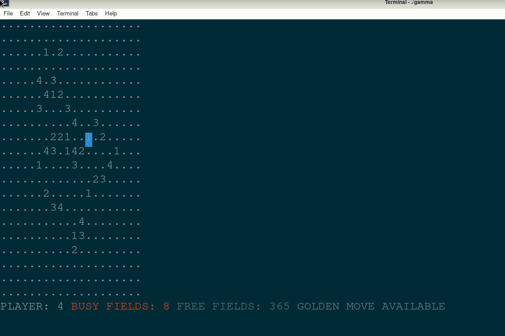

# IPP

### Project for Individual Programming Project class

To build:

1. $ mkdir dir
2. $ cd dir
3. $ cmake ..
4. $ make
5. $ make doc

To launch after building:

1. $ ./gamma Program then waits for user to write a game mode and game parameters:

> [I/B] [width] [height] [players] [areas]
>> I - interactive mode  
>> B - batch mode, used mainly for testing  
>> width/height - width/height of the board  
>> players - number of players  
>> areas - maximum number of areas that a player can have  
# About the game

Players play on rectangular board consisting of square fields. Adjacent fields make an area. A single field without adjacent
ones is also an area. A player can mark an empty field if he has less than [areas] areas. Every player can use once a golden
move that changes ownership of a field on the board to the player, who used the golden move. The previous owner can't
exceed [areas] areas though. Player who can't make a move loses the game.
